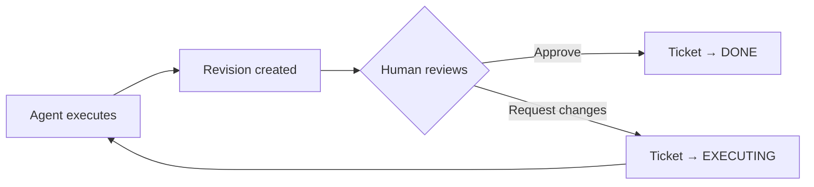

## Revisions

A **Revision** is created each time an AI agent executes on a ticket. Think of it like a PR — it captures the diff and enables code review.

### Key Properties

- **One revision per execute job**, incrementally numbered per ticket
- **Immutable diffs** stored as Evidence (stat + patch)
- New revisions automatically **supersede** previous open ones

### Revision Status

| Status | Meaning |
|--------|---------|
| `open` | Awaiting review |
| `changes_requested` | Reviewer requested changes |
| `approved` | Ready to merge/complete |
| `superseded` | Replaced by a newer revision |

## Code Review

Draft includes a built-in code review system:

### Review Comments

Leave line-level comments on specific changes:

```bash
curl -X POST http://localhost:8000/revisions/{id}/comments \
  -H "Content-Type: application/json" \
  -d '{
    "file_path": "src/auth.py",
    "line_number": 42,
    "content": "This should validate the token expiry"
  }'
```

### Review Summary

Submit a final review decision:

```bash
curl -X POST http://localhost:8000/revisions/{id}/review \
  -H "Content-Type: application/json" \
  -d '{
    "decision": "changes_requested",
    "summary": "Auth logic needs token expiry validation"
  }'
```

## Review Workflow



1. Agent implements ticket → **Revision** created with diff
2. Verification runs → ticket moves to `NEEDS_HUMAN`
3. Human reviews the revision in the UI
4. **Approve** → ticket completes
5. **Request changes** → agent gets another iteration with your feedback

## Viewing Diffs

The revision detail panel shows:
- **File-level diff** with additions and deletions
- **Stat summary** (files changed, insertions, deletions)
- **Review comments** inline with the diff
