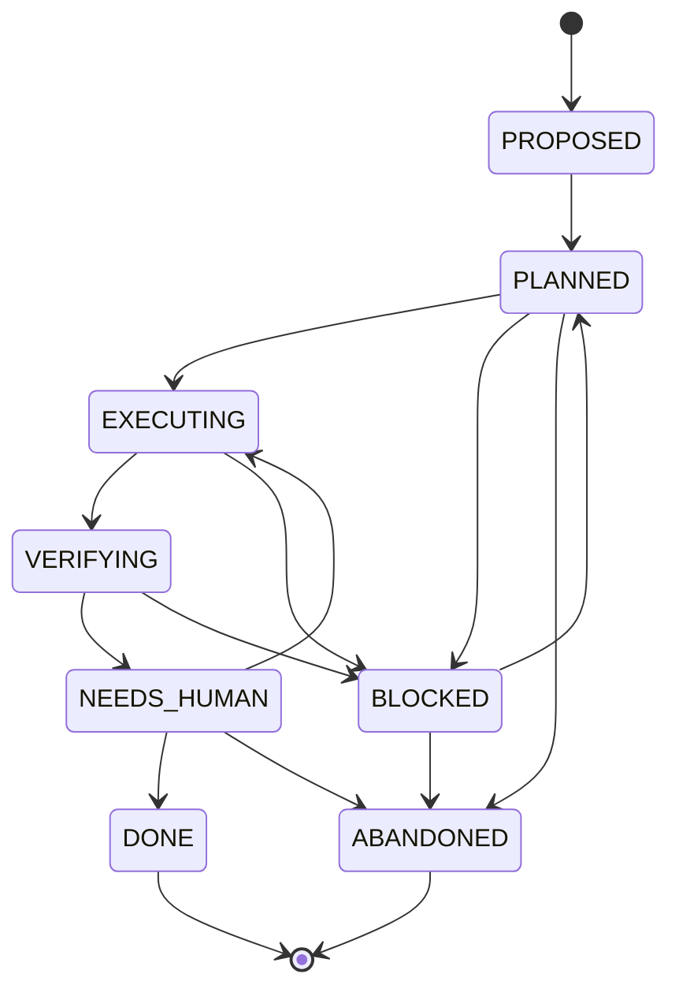

## Ticket Lifecycle

Every ticket in Draft follows a strict state machine. Transitions are validated — invalid transitions are rejected.



## States

| State | Description |
|-------|-------------|
| `PROPOSED` | Newly created ticket, awaiting human approval |
| `PLANNED` | Approved and ready for AI execution |
| `EXECUTING` | AI agent is actively implementing changes |
| `VERIFYING` | Running verification commands (tests, lints) |
| `NEEDS_HUMAN` | Verification passed, awaiting human review |
| `BLOCKED` | Execution or verification failed |
| `DONE` | Approved and complete |
| `ABANDONED` | Discarded, will not be implemented |

## State Transitions

### Happy Path
`PROPOSED` → `PLANNED` → `EXECUTING` → `VERIFYING` → `NEEDS_HUMAN` → `DONE`

### When Things Go Wrong

- **Execution fails** → `BLOCKED` (with reason: error message or "no changes")
- **Verification fails** → `BLOCKED` (with failing command details)
- **Human requests changes** → back to `EXECUTING` for another iteration

### Blocked Tickets

When a ticket becomes `BLOCKED`, the planner can:
1. **Propose follow-up tickets** to address the failure
2. **Auto-unblock** when a dependency completes
3. Wait for human intervention

## Transitioning Tickets

Via the API:

```bash
curl -X POST http://localhost:8000/tickets/{id}/transition \
  -H "Content-Type: application/json" \
  -d '{"state": "planned"}'
```

Via the UI, use the state buttons on each ticket card.

## Ticket Properties

| Field | Description |
|-------|-------------|
| `title` | Short description of the work |
| `description` | Detailed implementation instructions |
| `priority` | Execution order (lower = higher priority) |
| `state` | Current lifecycle state |
| `blocked_by_ticket_id` | Dependency on another ticket |
| `sort_order` | Display order within the board |
